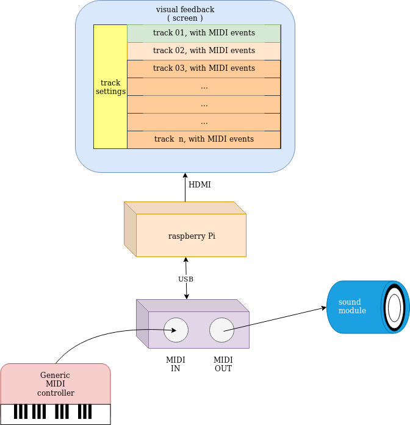

# squeezeLine milestones:

## raw list of ideas:

Given these [requirements](./project_requirements.md),\
A **more easy goal** would be to have the UI being controlled via a choosen MIDI channel.
**Leavin behind**, _at first_, the whole **GPIO thing**.

A little compromise =).

this is the project **reasonable** first goal 

I can define the first few milestones here:

### dev environment:

#### IDE

Given some suggestion, the choice for the IDE will be made between:
* CLion
* Qtcreator

These were discarded:
* C/C++ for Visual Studio Code // no particular reason
* vim // too "bare metal" to start learning C++

#### dev tool chain

* cmake
* make / autotools
* bash scripting

####  TDD / DDD

choose which framework to use (?)

#### UI:

I need to implement the timeline with tracks and clips

which toolkit is ok for this ?

* QT
* JUCE // this would be cool, since it provides "nearly" everything, and it's though for audio application from scratch.
* other (?)

### get precise timing impulse, to trigger events

what option do I have ?
are the ones below available?

* ALSA sequencer/raw MIDI API
* kernel syscall
* a "simple thread" with a callback function
    
do I need "real time preemption" ?

_i.e. do I need rlimits() and such ?_

### UI: how implement the timeline ( with clips )
     
what are the designs pattern useful for this ?

         
### I/O:
    
* how to read from GPIO
* how to read/write to ALSA USB/MIDI
* how to do all that from user space

