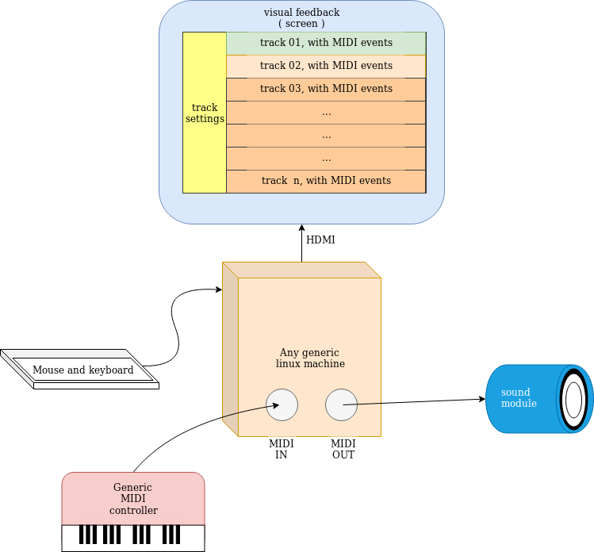

# squeezeLine milestones:

## A little compromise =) :

Given [these ideas](project_wannabe.md), we can target a **more feasible and easy goal** by splitting the "project wannabe" into different big steps.
* Since raspberry Pi was chosen just to have a broadly known target platform with GPIO,\
  to start learning C++, will be more convenient to **develop on a generic linux machine** .
* Also, would be in help, _at first_, **leaving beside** the whole **GPIO stuff**:\
  we could have the UI being controlled via a chosen MIDI channel among the 16 available.

This could be the first Project reasonable big goal:




## All that being said
The first few milestones here:

### define a dev environment:


#### UI framework:

This choice will drive the whole dev env setup, mainly.

Need to implement the timeline with tracks and clips...\
which toolkit is ok for this ?

**Juce** ( well documented ) // this would be cool, since it provides "nearly" everything, and it's though for audio application from scratch.\
**Nuklear** ( beign "Immediate Mode" forces me to learn more... )\
**Qt** ( personally I'm a bit skeptical about this, being it really heavy )\

On top of that, it could be nice to use **GuiLite within another framework** ( Juce or Qt, mainly )


#### IDE:

The final decision, actually, is left to the developer, obviously.\
I was given some suggestion, so the choice for the IDE will be made between:
* **CLion**
* **Qtcreator**

These were discarded:
* C/C++ for Visual Studio Code // for no particular reason
* vim // too "bare metal" to start learning C++


#### Tool chain:

the choice will be made among
* **cmake**
* **qmake**

and will be likely determined by the IDE.

These were discarded:
* make / autotools // I love the idea, but probably I can go back to them in another project
* bash scripting // would be cool and would be, honestly, a time sucker, too.


####  TDD / DDD framework:

choose which framework to use (?)


## Draft for next steps...

```text

### get precise timing impulse, to trigger events

what option do I have ?
are the ones below available?

* ALSA sequencer/raw MIDI API
* kernel syscall
* a "simple thread" with a callback function
    
do I need "real time preemption" ?

_i.e. do I need rlimits() and such ?_


### UI: how implement the timeline ( with clips )
     
what are the designs pattern useful for this ?

         
### I/O:
    
* how to read from GPIO
* how to read/write to ALSA USB/MIDI
* how to do all that from user space

```


