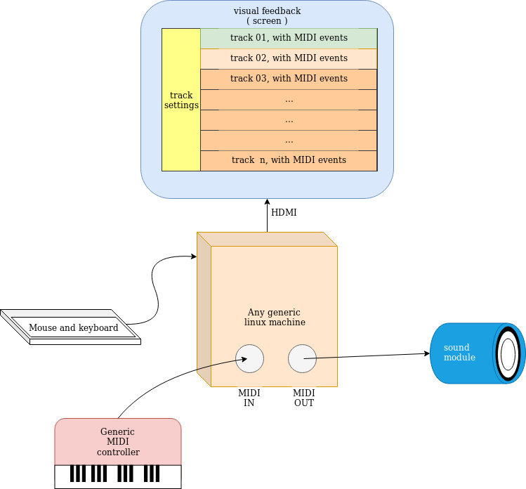

## A project _big_ step:

* Given the final goal of ths project (see [milestones](./milestones.md) ), it would help to **leave beside** the whole **GPIO stuff**:\
  we could have the UI being controlled via a chosen MIDI channel among the 16 available reading a standard MIDI input.
* Since, as "project final goal", a raspberry Pi was chosen just to have a broadly known target platform with GPIO,\
  it will be more convenient to **develop on a generic linux machine** in the first place .

This could be a big goal:

