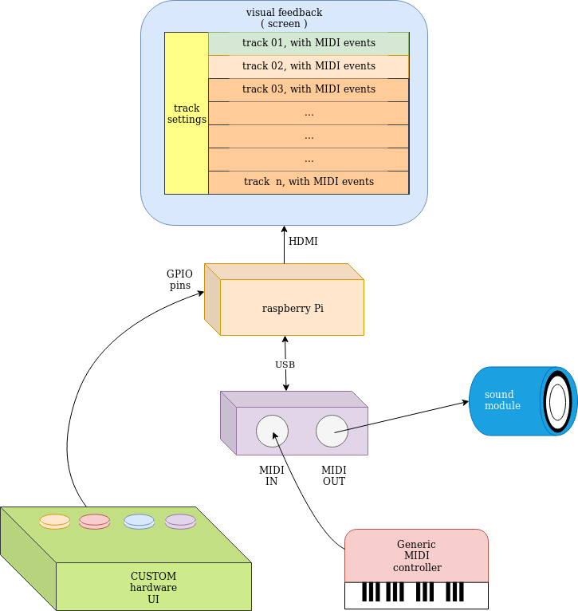

# squeezeLine wannabe:

## target:

The final "wanna be" is to be a simple MIDI Sequencer, running on a little device, like Raspberry Pi.

This is the project "wannabe" :

## product requirements:
        
There will be a horizontal timeline, filled with MIDI tracks\
Each track will host MIDI events and will allow event editing.\
Many similar projects use ALSA, I would do the same.

    input
    -----

        * GPIO for control purposes
        * ALSA -> USB/MIDI interface to control external devices
        
    output
    -----
        * ALSA -> USB/MIDI interface to record events

The final artifact will be an
    **executable binary**
( it's too early to think at *.deb package or raspbian ISO ) .

Ideally, every functionality would be operated by "physical" controls, like
    **"endless rotary encoders"** and **buttons**.

## development requirements:

Would like to develop in a **TDD / DDD manner**, \
with **automated tests** at each build

